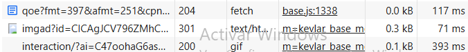
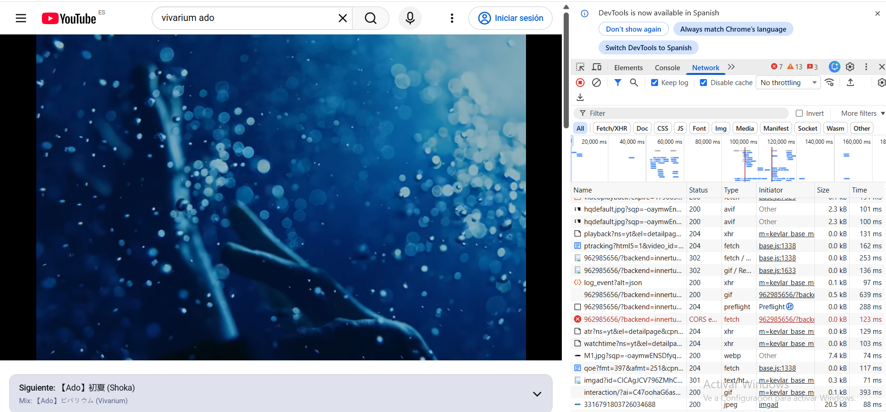

# MINI PROYECTO DWEC: Análisis de YouTube

## 1. Introducción

En este proyecto vamos a analizar cómo funciona una aplicación web que utilizamos habitualmente: **YouTube**.

YouTube es una plataforma que como todos conocemos permite buscar, reproducir y compartir vídeos. Aunque desde fuera parece una aplicación sencilla, por detrás intervienen diferentes partes que trabajan conjuntamente.

Por un lado, tenemos la parte que vemos y utilizamos desde el navegador, es decir, el **frontend**. Por otro lado, está el **backend**, que se encuentra en los servidores de YouTube y se encarga de procesar las peticiones y proporcionar la información que necesita la aplicación.

El objetivo de este proyecto es conocer mejor cómo se divide una aplicación web entre frontend y backend y cómo se comunican ambas partes mediante peticiones HTTP/HTTPS.

---

## 2. Aplicación elegida

**Aplicación:** YouTube

**Página web:** https://www.youtube.com/

Para realizar el análisis nos hemos centrado en una acción bastante sencilla: **buscar un vídeo en YouTube y acceder a los resultados**.

El proceso que seguimos es el siguiente:

1. El usuario entra en la página de YouTube.
2. Escribe lo que quiere buscar en el buscador.
3. El navegador realiza diferentes peticiones al servidor.
4. Los servidores de YouTube reciben y procesan esas peticiones.
5. El servidor devuelve la información necesaria.
6. El navegador recibe los datos y muestra los resultados.
7. El usuario puede seleccionar uno de los vídeos y reproducirlo.

---

## 3. Arquitectura cliente-servidor

YouTube utiliza una arquitectura basada en la comunicación entre el **cliente** y el **servidor**.

### Cliente / Frontend

La parte cliente es principalmente el navegador que estamos utilizando.

Es la parte con la que interactúa directamente el usuario. Por ejemplo, cuando buscamos un vídeo, pulsamos un botón o seleccionamos un resultado, estamos interactuando con el frontend.

En esta parte encontramos elementos como:

- HTML.
- CSS.
- JavaScript.
- El buscador.
- La lista de vídeos.
- Los botones y controles.
- El reproductor de vídeo.
- Los diferentes elementos de la interfaz.

En resumen, el frontend es el encargado de mostrar la página y permitir que el usuario pueda interactuar con ella.

### Servidor / Backend

El backend se encuentra en los servidores de YouTube y se encarga de procesar las peticiones que recibe desde los navegadores.

Entre sus funciones podemos encontrar:

- Recibir las peticiones de los usuarios.
- Procesar las búsquedas.
- Obtener la información de los vídeos.
- Gestionar las cuentas de usuario.
- Enviar los datos necesarios al frontend.
- Gestionar diferentes servicios relacionados con los vídeos y su reproducción.

Por tanto, el backend es una parte de la aplicación que el usuario no ve directamente, pero que es necesaria para que YouTube pueda funcionar correctamente.

---

## 4. Recorrido de una petición

De forma simplificada, el recorrido de una petición en YouTube sería el siguiente:

```text
                    USUARIO
                       |
                       | Interactúa con la página
                       v
              +-------------------+
              |     NAVEGADOR     |
              |     FRONTEND      |
              +-------------------+
                       |
                       | Petición HTTPS
                       v
              +-------------------+
              |     SERVIDOR      |
              |      BACKEND      |
              +-------------------+
                       |
                       | Procesa la petición
                       v
              +-------------------+
              | Datos / Servicios |
              +-------------------+
                       |
                       | Respuesta
                       v
              +-------------------+
              |     NAVEGADOR     |
              |     FRONTEND      |
              +-------------------+
                       |
                       v
                    USUARIO
```

## 5. Ejemplos de peticiones

A continuación observamos una captura de la pantalla DevTools(pestaña) mostrando tres peticiones comentadas: método, código de estado, Content-Type, Size y Time

### Peticiones analizadas

En la captura podemos ver tres peticiones realizadas por YouTube:

- **Primera:** código `204`, tarda `117 ms` y no devuelve contenido.
- **Segunda:** código `301`, tarda `71 ms` y realiza una redirección.
- **Tercera:** código `200`, tarda `393 ms` y se realiza correctamente.


Esto nos muestra que, mientras usamos YouTube, el navegador realiza diferentes peticiones al servidor en segundo plano.


Aquí podemos ver la captura completa en la que se comprueba que es de la aplicacion YouTube.




